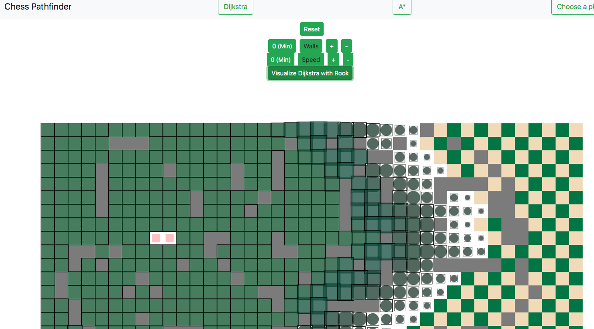

Access this project at: http://chesspathfinder.herokuapp.com/

- Add/remove walls by dragging mouse on board or clicking the add/remove walls buttons
- Choose a piece
  - Rook moves horizontally and vertically
  - Bishop moves diagonally
  - Queen moves all directions
  - Horse jumps in 'L' movements
- Visualize Dijkstra or A* algorithm by selecting appropriate button
- Increase/Decrease speed of visualization by selecting +/- speed buttons

In progress functions:
- Chess piece movements (Only Rook currently)

